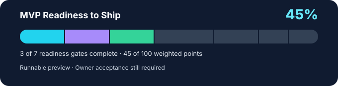

# Estimation Coach

A visual, local-first Flutter coach for the **Estimation card game**. Read the
table, tap a bid or card, and get concise, reviewed coaching that explains the
evidence behind the decision.

[](https://github.com/abdallah-gaber/estimation-coach/actions/workflows/ci.yml)



**Status: runnable preview, not yet MVP.** Ten bidding hands and ten play
scenarios work with deterministic feedback. Saved personal coaching, varied
sessions, the hub and English/مصري switching are still ahead.
**Current focus:** checkpoint 1 is complete; next is **EC-049 — Anti-memorization
sessions** (not started). All five EC-043 scenarios are reviewed.

Readiness is calculated from [fixed weighted gates](docs/MVP_STATUS.md#fixed-weighted-readiness-gates):
**15 + 15 + 15 = 45%**. Completing checkpoint 1 alone earns no Variety gate
credit: checkpoints 2 and 3 must also close. The CI badge reports main's formatting, analysis, tests,
scenario validation and web build separately.

## Seven checkpoints to MVP

1. **Finish EC-043 — DONE** — five reviewed exact-bid-protection scenarios.
2. **Anti-memorization sessions** — shuffle selection, avoid immediate repeats,
   and separate session order from catalog/file order.
3. **Scenario Variants + Content Breadth** — validated deterministic variants
   and reviewed variety that requires reasoning.
4. **Personal Coaching** — local decisions, skill aggregation and weak areas.
5. **Training Hub** — Quick Mix, Bid Practice, Play Practice, Weak Areas, Continue.
6. **Egyptian Arabic + UI polish** — مصري terms, localization/RTL and usability.
7. **MVP Acceptance** — repeated owner sessions, intended-device fixes, then
   `v1.0.0-mvp`.

The finish plan is frozen. New work is classified as **MVP BLOCKER** or
**POST-MVP**, not silently added to the roadmap.

[MVP status & Definition of Done](docs/MVP_STATUS.md) ·
[Task tracker](PROJECT_TRACKER.md) ·
[Canonical rules](docs/GAME_RULES_V1.md) ·
[Scenario authoring](docs/SCENARIO_AUTHORING.md)

## Run and contribute

```sh
flutter pub get
flutter run -d chrome
```

Scenarios live in `content/scenarios/v1/`; adding supported content needs no
widget changes. See [contributor rules](AGENTS.md),
[decisions](docs/DECISIONS.md) and [coaching review](docs/COACHING_REVIEW.md).
Runtime AI, backend/accounts, multiplayer, full-round simulation and complete
scoring are post-MVP. The trainer's decisions and coaching work locally.

## Development and manual testing

This checkpoint has ten independent hands: four Dash/enter decisions and six
normal-bidding situations. All 53 legal choices have deterministic authored feedback.
Read the [coaching review](docs/COACHING_REVIEW.md) for rating rationale.
A reviewed play-practice session is available from the table icon in the top
bar (see below). There is no full auction, simulated outcome, saved progress,
winner resolution or scoring yet.

Validated toolchain: Flutter 3.44.1 stable / Dart 3.12.1.

```sh
flutter pub get
flutter run -d chrome
```

Alternatively, run `flutter run -d web-server --web-port 8082` and open
http://localhost:8082. Stop the app with `q` in its terminal. Native runners are
generated but unvalidated; use `flutter devices` to see available targets.

### What to test

1. See a 13-card hand, South's position, and **Before bidding · Trump unknown**.
2. Choose **Dash · 0 tricks**: expect **Weak decision** and a fixed zero estimate.
   Open **Why?** for the evidence. Choose **Try another choice**, then
   **Enter bidding**: expect **Strong decision**, with no target chosen yet.
3. Choose **Next hand**: a different hand appears with West's pass and North's
   4 Hearts. Dash must not be available during normal bidding.
4. Choose **4**: only Spades and Sans are enabled. Choose **5**: all suits unlock.
   Select Hearts, then change to 4: Hearts clears and **Review bid** is disabled.
5. Submit **4 Spades**: expect **Reasonable**. Try **4 Sans** (Risky),
   **5 Spades** (Risky), and **7 Clubs** (Weak decision). Check that the explanation
   matches your choice. Outcomes are explicitly not simulated.
6. Continue through hands 3–5: a balanced low hand makes Dash reasonable, while
   the singleton King and seven low Clubs make Dash risky. Enter stays reasonable.
7. Hands 6–10 compare trump control and targets. In hand 8, 5 Clubs beats
   4 Sans and receives Strong decision; 5 Spades receives Weak decision. In hand
   9, East is already Dash at zero and is absent from normal bid history.
8. Finish all ten hands, then **Practice again**: the first hand resets.
9. Resize to 320px and increase text size: cards and controls should wrap and
   remain reachable by scrolling. Use Tab/Enter to choose buttons and chips.
10. Refresh: the session starts over. Progress is not persisted in this checkpoint.

### Test Play practice

1. Tap the table icon at the top right (tooltip/accessibility label:
   **Play practice**).
2. Verify North above, West left, East right, and **You · South** below the
   current trick, with the leader's seat labelled **Led &lt;suit&gt;** and the
   other two opponents labelled with their taken-trick count.
3. **Situation 1 of 10** ("A free trick with the ace of Hearts"): Hearts were
   led; the 2 of Clubs and 5 of Diamonds are locked because you hold Hearts.
   Playing the ace is **Strong decision**; playing the three is **Weak
   decision**.
4. Choose **Next situation**: hand 2 ("The last spade wins an open trick")
   loads. You are void in the led suit, so both 2 of Spades (trump) and 7 of
   Clubs are legal. Play the 2 of Spades: expect **Strong decision** — it wins
   the open trick outright since you act last. Try **Try another choice**,
   then play 7 of Clubs instead: expect **Weak decision** for giving away a
   needed trick.
5. Situations 3–5 train the exact target:
   - **One trick short of your target**: status **Below target**, taken 3,
     target 4. King of Hearts is **Strong decision**; three is **Risky**.
   - **Four is enough**: same cards, taken 4, target 4, **Exactly on target**.
     Three of Hearts is **Strong decision** for deliberately losing; king is
     **Weak decision** for taking an unwanted fifth trick.
   - **Already past four**: **Already above target**, taken 5, target 4.
     Club loses and spade wins. Both are **Reasonable**: neither restores
     four, and no scoring preference is asserted. Read both explanations.
   Use **Try another choice** to compare. Counts and **Before this play**
   status remain the original snapshot after committing either card.
6. Situation 6 (**A trump is already on the table**): on four of four, play 2S
   beneath the visible JS for **Strong decision**; KS takes an unwanted fifth
   (**Weak decision**); 7C also loses (**Reasonable**).
   Situation 7 (**One more trick in Sans**): below target in
   Sans, AH is **Strong**, QH **Reasonable**, 3H **Risky**; 2C is locked.
   Compare **Why?**: both high Hearts win now; future leads are not predicted.
7. Situations 8–10 add an **Observed play** section above the current trick: a
   compact, muted earlier trick, not labelled as "the last trick" since it is
   only the evidence relevant to this decision. In situation 8 ("Save the king
   from a known void"), that trick shows East failing to follow Diamonds —
   playing the 3 (saving the now-unbeatable king) is **Strong decision**;
   playing the king is **Risky** because East's void means East decides
   whether it gets trumped. The pack does not compute this itself — voids are
   never authored, only derived from the shown history.
8. Selecting a card moves it visually into the current trick with a short
   flight animation and locks further play; reduced-motion settings skip the
   flight. Open **Why?** for the evidence, same as bidding feedback.
   **Outcome: not simulated** — no winner is resolved or scored yet.
9. Finish all ten situations, then **Practice again**: the first situation
   resets.
10. Back returns to the same bidding hand and any feedback already displayed.
11. At 320px width and large text, scroll through the table and hand. Seat labels,
   suit shapes, cards and selection controls should remain readable.

This is a small reviewed pack (10 situations, 22 evaluated choices) connecting
the completed portable play contract (EC-046) to coached play (EC-047), plus
derived void tracking (EC-042) and five exact-bid-protection scenarios (EC-043).
Winner resolution and scoring remain out of scope; see the confirmed
[trick-winner rules](docs/GAME_RULES_V1.md#trick-winners), not yet used by any
resolver.

Egyptian Arabic language switching and local game terminology are tracked in
EC-060. The language option is not implemented yet. The owner-confirmed
[glossary](docs/EGYPTIAN_ARABIC.md) distinguishes الكول from each player's trick
estimate (طالب كام؟).

### Automated checks

```sh
dart format --output=none --set-exit-if-changed lib test tool
flutter analyze
flutter test
dart run tool/validate_scenarios.dart --require-complete
flutter build web
```

Strict validation should pass all twenty scenario files (ten bidding, ten play)
with no missing evaluations. Tests cover cards, game rules, derived void
tracking and the known winning auction bound: a supplied bid of 4 cannot
accompany estimate 5; absent auction context stays supported. Regression tests
exercise domain, parser and strict catalog rejection. Tests also cover
parser/schema alignment, validator failure cases, authored
evaluation, bundled loading, legal choice controls, feedback, session
restart, load retry, card-commit animation (including reduced motion and
route disposal mid-flight), and a 320px layout with double text scaling for
both the bidding and play trainers.
The older card specimen remains independently tested.

Canonical rules: [game_rules_v1](docs/GAME_RULES_V1.md).
Content contract and CLI usage: [authoring guide](docs/SCENARIO_AUTHORING.md).
